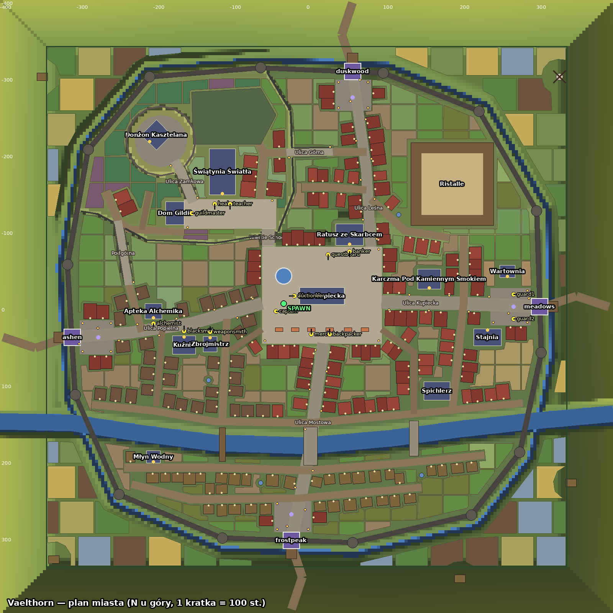
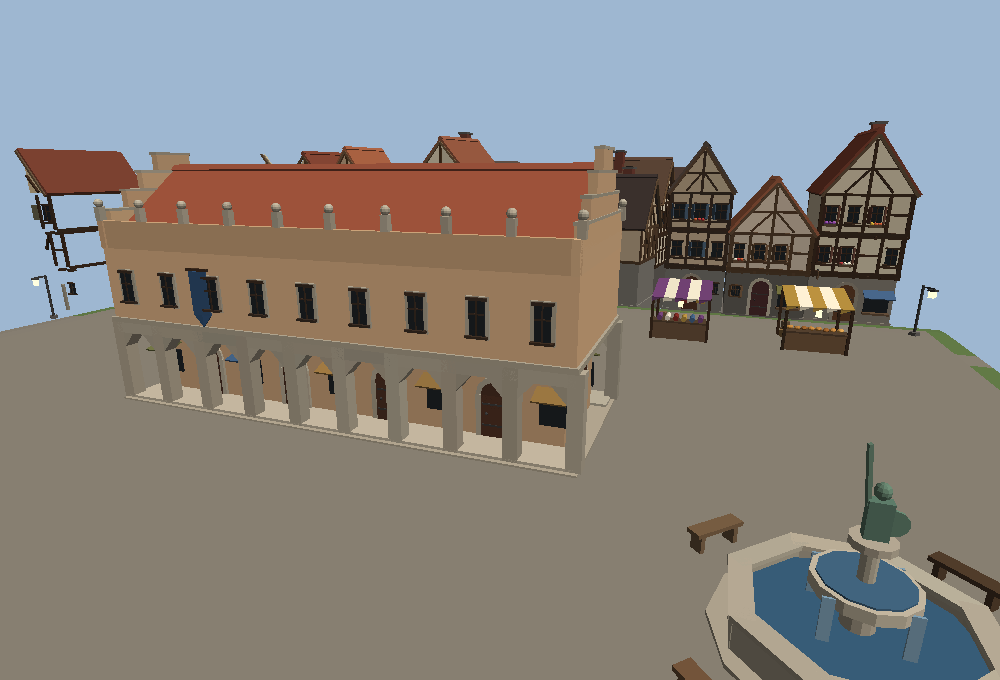
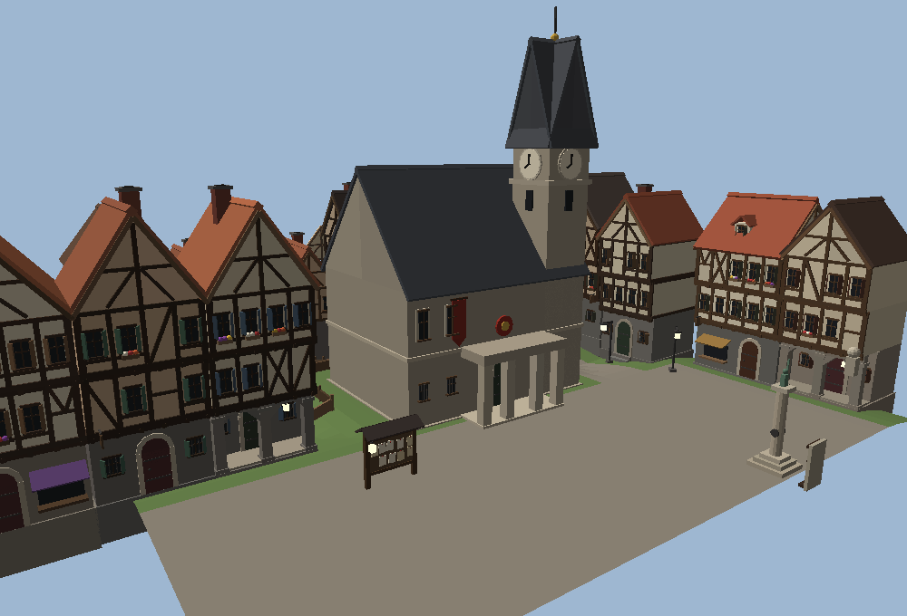
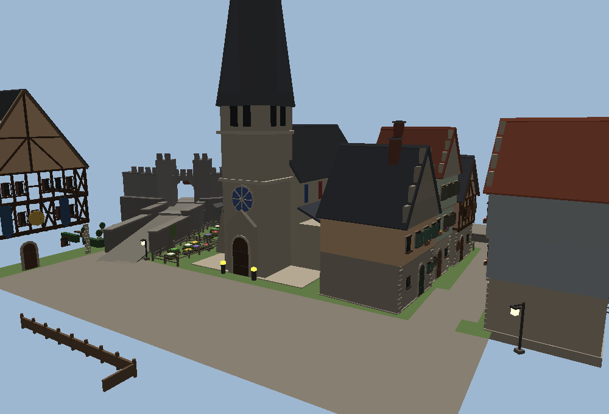
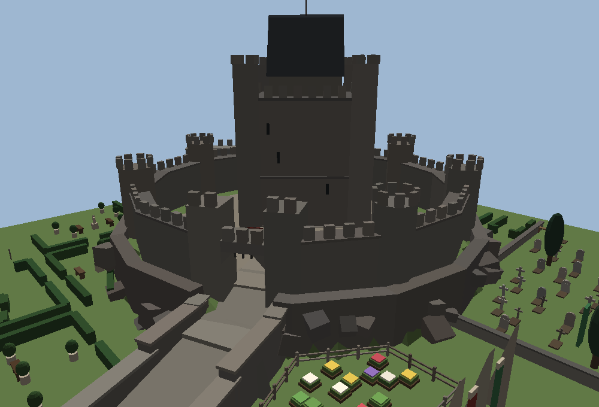
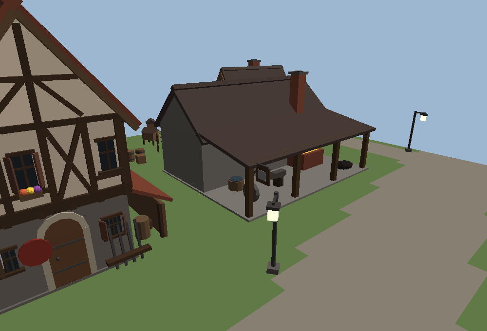
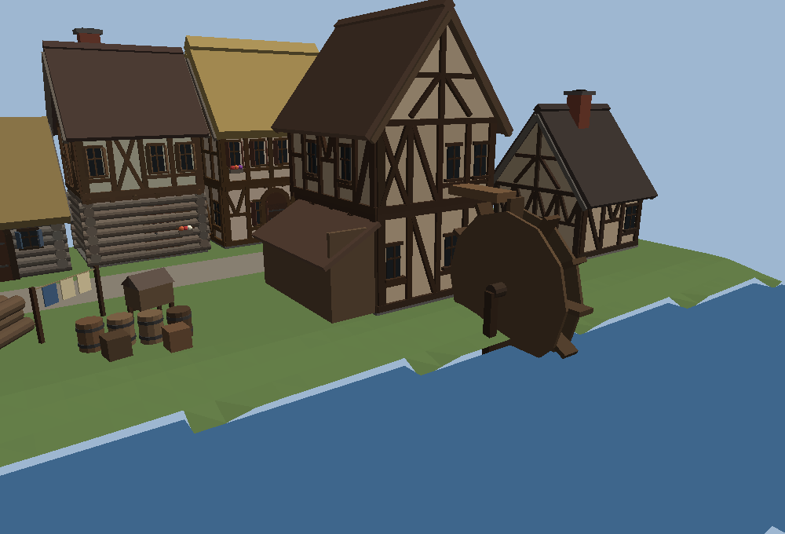
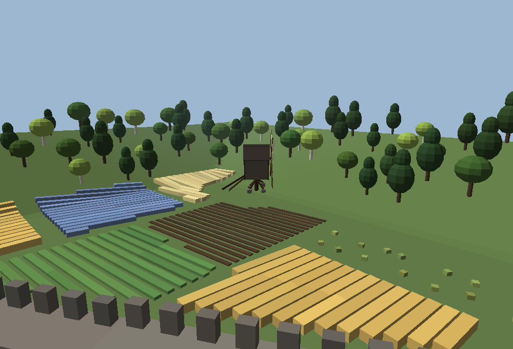
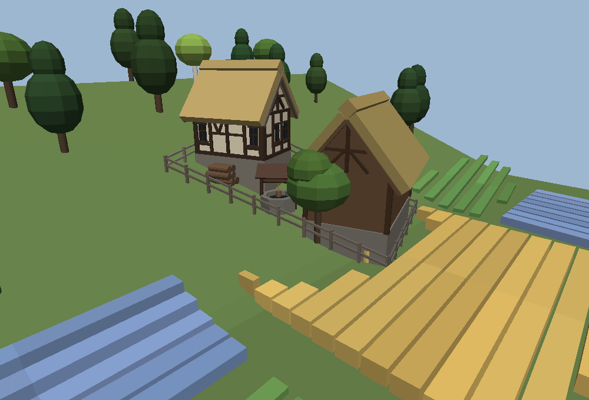
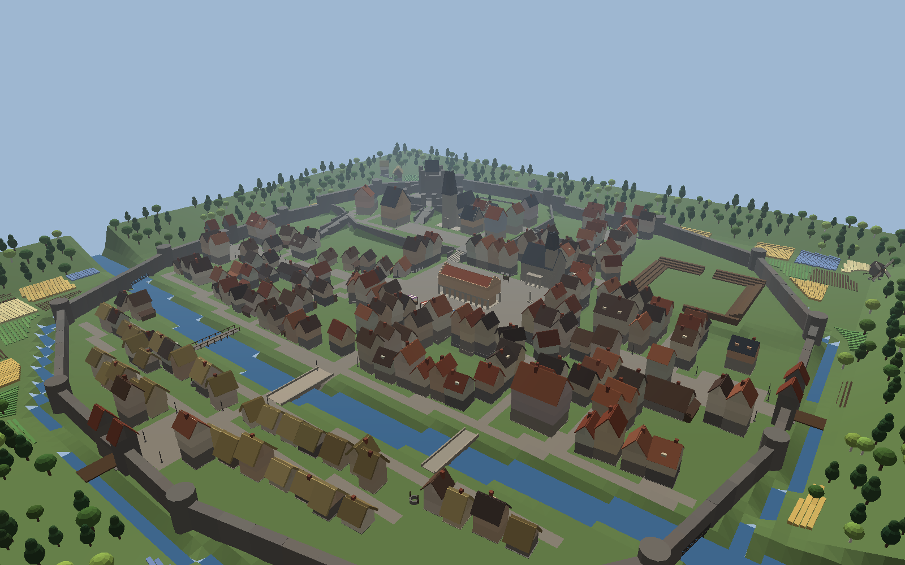

# Miasto startowe Vaelthorn: specyfikacja (S21)

Ten dokument opisuje nowe miasto startowe: układ, teren, budynki, generator części i to, jak gra ma to zbudować. Dane i generator są już w repozytorium (czysty Luau, z testami); sesja S21 podłącza je do świata.



## 1. Pliki

| Co | Gdzie |
|---|---|
| Dane miasta (wygenerowane, nie edytować ręcznie) | `src/shared/Data/Town/city.luau` |
| Typy i dostęp: `Town.city`, `Town.special(id)`, `Town.npcSpot(id)`, `Town.gate(target)` | `src/shared/Data/Town/init.luau`, `Types.luau` |
| Geometria 2D: `inPoly`, `edgeDist`, `lineDist`, `segDist`, `rect`, `front`, `door` | `src/shared/Logic/TownGeom.luau` |
| Teren: `TownTerrain.heightAt(x, z)`, `materialAt(x, z, h, slope)`, `voxels(...)` (bloki do `WriteVoxels`) | `src/shared/Logic/TownTerrain.luau` |
| Zapis terenu w Roblox: `TownTerrainWriter.write(origin, half, yields)` | `src/server/World/TownTerrainWriter.luau` |
| Generator budynków (Blueprinty): `TownGen.all(city, ground)` (wszystkie Buildy), `TownGen.radius(build)`, moduły `Houses`, `Structures`, `Specials`, `Props`, `Gardens`, `Outside`, `Parts`, `Palette`, `Fill` | `src/shared/Logic/TownGen/*` |
| Części z Blueprintów: `BlueprintBuild.build(build, origin, lods, parent, pacer?)` | `src/shared/Util/BlueprintBuild.luau` |
| Szkic miasta na minimapę i mapę: `TownSketch.shapes()` | `src/shared/Logic/TownSketch.luau` |
| Testy | `tests/town.spec.luau` (plan, chodzenie BFS), `tests/townterrain.spec.luau` (zgodność terenu z Pythonem, materiały, woksele), `tests/towngen.spec.luau` (budżety, determinizm, haki animacji), `tests/townsketch.spec.luau` (szkic) |
| Zrzut części do JSON (podgląd) | `lune run tools/dump.luau out.json x1 z1 x2 z2 [houses,walls,...]` |
| Narzędzia planu w Pythonie i podglądy | `docs/miasto/tools/` (zob. §13) |

Wszystkie moduły TownGen są **deterministyczne i czyste**: ten sam plan i ta sama funkcja wysokości dają te same części na serwerze i na każdym kliencie. Dzięki temu klient buduje detale sam, bez przesyłania ich przez sieć.

## 2. Styl

- **Średniowieczne miasto handlowe z XIV–XV w.**, poważne fantasy, bez kreskówkowej przesady. Wzór: małe miasta niemieckie i polskie (Sukiennice, ratusz z wieżą zegarową, kamieniczki z szachulca, podcienia).
- **Stare drewno**: belki szachulca prawie czarne lub ciemnobrązowe (`Palette.timber`), deski zszarzałe (`greyPlanks`), tynki złamane, ciepłe (`plaster`, `richPlaster`), kamień wapienny i polny (`ashlar`, `rubble`), dachy z gontu, dachówki, strzechy i łupka. Każdy kolor dostaje drobny losowy „wiek” (`Blueprint:jitter`), więc nie ma dwóch identycznych belek.
- Domy: piętra wysunięte (jetty), okna z kratką ołowianą, okiennice, skrzynki z kwiatami, szyldy na żelaznych wysięgnikach, kominy z dymem, mech na dachach, dachówki i strzechy, lukarny, schodkowe szczyty kamienic patrycjuszy, podcienia w rynku, przybudówki rzemieślników.
- Teren nie jest płaski: wzgórze zamkowe z klifem, górne miasto na tarasie z murem oporowym, rampy i Wielkie Schody, rzeka z mostami, fosa za murami, pagórki i las na skraju mapy.
- Noc: okna świecą ciepło, latarnie i pochodnie palą się, w karczmie i kuźni ogień. **Uwaga:** gra po S20 nie ma cyklu dnia i nocy (`WorldController.applyEnvironment` ustawia stałe oświetlenie mapy, w mieście godzina 15). Nocne zachowanie tagów działa dopiero, gdy S21 doda cykl (priorytet P3); do tego czasu okna i latarnie zostają w stanie dziennym, komenda admina `/daytime <godzina>` (S21) pozwala to sprawdzić.

## 3. Układ

Mapa ma **800 × 800 st.** (środek w 0,0; `city.size = 800`). Miasto otacza mur (wielokąt `city.wall`, 14 wierzchołków), za nim fosa, pola, farmy, wiatrak i las.

| Element | Dane | Uwagi |
|---|---|---|
| Bramy (4) | `city.gates`: `east` → meadows, `north` → duskwood, `west` → ashen, `south` → frostpeak | w każdej bramie pole portalu; `arrive` = punkt przybycia do miasta z tej mapy |
| Spawn | `city.spawn` (-30, -4), patrzy na zachód | na rynku przy fontannie |
| Place (7) | `city.squares`: Rynek, Plac Świątynny, Dziedziniec Zamkowy, 4 place przy bramach | materiał nawierzchni w polu `mat` |
| Ulice (22) | `city.streets`: 4 główne (18–14 st.), 14 bocznych (10), 4 zaułki (8) | wielolinie z szerokością |
| Rampy (4) | `city.terrain.ramps`: Wielkie Schody (schody), Ulica Zamkowa, Podgórna, Ulica Górna | wysokość na rampie z `pts {x, z, y}` |
| Rzeka i mosty | `city.terrain.river`, `city.bridges` (3) | woda na y = -1.5; kamienne i drewniany most |
| Dzielnice (7) | `city.districts` | styl domów zależy od dzielnicy |
| Działki (176) | `city.lots`: 108 kamienic, 32 domy rzemieślników, 36 chałup | styl: mieszczański, patrycjuszowski, rzemieślniczy, chłopski |
| Budowle specjalne (14) | `city.specials` | §6 |
| Stragany (6) | `city.stalls` | kupiec i sakwiarz stoją za ladą |
| Mury oporowe (59) | `city.retaining` | krawędzie tarasów, boki ramp, klif zamkowy |
| Ogrody (153) | `city.gardens` | §8 |
| Latarnie (60) | `city.lamps` | słupy co ok. 26 st. przy głównych ulicach i latarnie przy rampach |
| Okolica (§9) | `city.outside` | las od max(|x|,|z|) ≥ 340, wiatrak, 4 farmy, ruina, 4 drogi z mostami zwodzonymi, 51 pól |

### NPC

Pozycje w `city.npcs` (x, z, kierunek). Wysokość zawsze z `TownTerrain.heightAt`. Pole `at` mówi, przy jakim budynku stoją (test pilnuje, by stali najwyżej 16 st. od drzwi, a przy straganie 9 st.).

| NPC | Pozycja | Gdzie |
|---|---|---|
| captain | -40, 6 | rynek przy spawnie |
| questboard | 28, -68 | tablica ogłoszeń na rynku, przed ratuszem (model tablicy z `Props`) |
| banker | 56, -72 | ratusz, przed podcieniem |
| auctioneer | -16, -14 | Hala Kupiecka (Sukiennice), zachodni koniec |
| merchant, backpacker | 6, 36 i 30, 36 | za ladą straganów |
| healer, teacher | -120, -134 i -100, -134 | przed Świątynią Światła |
| guildmaster | -150, -122 | przed Domem Gildii |
| blacksmith | -160, 32 | przed kuźnią |
| weaponsmith | -126, 33 | przed Zbrojmistrzem |
| alchemist | -200, 22 | przed Apteką |
| guard1, guard2 | 270, ±16 | przy bramie wschodniej |

## 4. Teren

`TownTerrain.heightAt(x, z)` to jedyne źródło wysokości (ten sam wzór jest w `docs/miasto/tools/plan.py`; test pilnuje zgodności do 0.001). Składniki:

1. **W murach**: łagodny szum (amp 0.8, skala 45). **Za murami**: pagórki `smoothstep(dWall/30) * (1.5 + 5·szum(x/70, z/70) + max(0, max(|x|,|z|) − 330)·0.35)`, więc teren rośnie ku krawędzi mapy.
2. **Tarasy** (`plateaus`): rynek y 4, górne miasto y 12 (krawędź `wall` = mur oporowy), wzgórze zamkowe y 20 (krawędź `cliff`), północny wschód y 6, ristalle y 6, plac ratusza y 4. Łączenie przez `max`, krawędzie miękkie (blend) albo ostre.
3. **Fosa** tylko za murami: pas 13 ± 7 st. od muru, dno -4.5.
4. **Rampy**: w pasie rampy (≤ w/2 od jej osi) wysokość z rampy nadpisuje teren.
5. **Rzeka**: koryto do -6, brzegi łagodnie do lustra wody -1.5.

### Materiały terenu (malowanie)

| Gdzie | Materiał |
|---|---|
| Domyślnie w murach | Grass, z plamami LeafyGrass (szum) |
| Ulice główne | Cobblestone |
| Ulice boczne | Pavement |
| Zaułki | Ground |
| Place | z pola `mat` (Rynek i Plac Świątynny: Limestone, reszta: Cobblestone) |
| Ristalle (piasek areny, kwadrat ±40 st.) | Sand |
| Rampy zwykłe | Cobblestone; Wielkie Schody mają stopnie z części |
| Ogrody | sad LeafyGrass, warzywnik i winnica Ground, ogród formalny Grass, podwórze Ground, ogród przydomowy Grass, wybieg Mud, zioła Ground, plac ćwiczeń Sand, łąka i pastwisko LeafyGrass |
| Cmentarz | Grass |
| Brzegi rzeki (pas `bank`) | Mud; koryto i fosa: Water do poziomu -1.5 |
| Klif zamkowy i strome zbocza (nachylenie > 40°) | Rock |
| Za murami | LeafyGrass; drogi wyjazdowe Ground (szer. 12); pola: zaorane Ground, reszta Grass |
| Las (pas od 340) | LeafyGrass z plamami Mud |

Tę tabelę realizuje `TownTerrain.materialAt` (pierwsze dopasowanie wygrywa: dno rzeki, piasek ristalle, place, rampy, ulice, brzegi, strome zbocza, ogrody, cmentarz, potem trawa; za murami fosa, drogi, pola i las). `TownTerrain.voxels(x0, z0, nx, nz, yBottom, ny)` zwraca gotowe tablice materiałów (nazwy) i wypełnienia dla siatki 4 st., z wodą do poziomu -1.5 w rzece i fosie. `TownTerrainWriter.write` zapisuje nimi całe miasto blokami 64×64 st. od y -16 do 64, z marginesem 64 st. za krawędzią mapy (ok. 0,4 s liczenia w Lune). Kolor materiału `Limestone` nie jest dziś ustawiony w `WorldBuilder` (`MATERIAL_COLORS`); żadna inna mapa go nie używa, więc można mu dać ciepły jasny kolor kamienia (np. `#B9AE96`).

## 5. Blueprint i budowanie części

Generator nie tworzy instancji. Każdy budynek to **Build** `{ name, bp, at = {x, y, z, rot}, tag, gate? }`, a `bp.pieces` to lista części w przestrzeni lokalnej budynku:

```
Piece = { s = "box"|"wedge"|"cyl"|"ball"|"corner", size = {x,y,z}, p = {x,y,z}, r = {9 liczb, row-major},
          c = "#RRGGBB", m = "Enum.Material name", lod = "shell"|"detail"|"fine",
          col = CanCollide, q = CanQuery, t = Transparency?, tag = string? }
Light = { p = {x,y,z}, color, range, brightness, tag? }
```

Instancje tworzy `BlueprintBuild.build` (wspólny dla serwera i klienta). Część w świecie: `CFrame.new(at.x, at.y, at.z) * CFrame.Angles(0, math.rad(at.rot), 0) * CFrame.new(p[1], p[2], p[3], r[1], r[2], r[3], r[4], r[5], r[6], r[7], r[8], r[9])` (przesunięcie mapy dodać do `at`). Kształty: `box` = Part Block, `wedge` = WedgePart, `cyl` = Part Cylinder (oś lokalna X), `ball` = Part Ball, `corner` = CornerWedgePart. Kolor `Color3.fromHex(c)`, materiał `Enum.Material[m]`, zawsze `Anchored = true`, `CanTouch = false`, `CastShadow = false` dla części o najdłuższym boku < 2 st., `Locked = true`. **Kule o nierównych bokach** (korony drzew, krzaki, stogi: ok. 3 tys. części, w tym 860 w shell) to `Part` Block z `SpecialMesh` typu Sphere, bo `Shape = Ball` zawsze daje kulę. Światła (`bp.lights`, 101 sztuk) powstają razem z poziomem `detail`, poza światłami portali (z shell). Części z tagiem mają atrybuty `Fx` (tag) i `Build` (nazwa budowli) oraz tag CollectionService `TownFx`.

### Poziomy szczegółu (LOD)

| LOD | Kto buduje | Kiedy | Co |
|---|---|---|---|
| `shell` | **serwer**, przy budowie mapy | zawsze | bryły, dachy, mury, kolizje, sylwetka z daleka |
| `detail` | **klient**, lokalnie (bez replikacji) | budynki w promieniu ustawienia „Szczegółowość świata” z S20: niska 120, średnia 220, wysoka 400 st. | belki, okna, drzwi, okiennice, szyldy, ozdoby, ogrody |
| `fine` | klient | w promieniu ok. 90 st. (niska: 60) | kwiaty, nity, kratki okien, mech, drobiazgi |

Klient uruchamia te same moduły TownGen (dane są w ReplicatedStorage), buduje `detail` i `fine` stopniowo (limit części na klatkę, np. 400), z histerezą przy usuwaniu (+40 st.) i pulą modeli. Shell z serwera i detale klienta to osobne modele, więc streaming nie przeszkadza.

### Budżety (pilnuje `tests/towngen.spec.luau`)

| Rodzaj | shell | detail | fine |
|---|---|---|---|
| Dom | ≤ 24 | ≤ 260 | ≤ 90 |
| Budowla specjalna | ≤ 80 | ≤ 340 | ≤ 140 |
| Ogród | 0 | ≤ 120 | ≤ 40 |
| Kawałek lasu 100×100 | ≤ 140 | 0 | 0 |
| **Razem miasto** | **≈ 5 300** (limit 6 500) | ≈ 28 500 | ≈ 8 000 |

Serwer buduje więc ok. 5,3 tys. części (mieści się w dzisiejszym limicie `Config.MaxPartsPerMap` = 8000; S21 dodaje pole `maxParts` w danych mapy jako ostrzejszy budżet dla miasta). Klient w najgęstszym miejscu i na wysokiej jakości buduje kilkanaście tysięcy części detalu, na niskiej kilka tysięcy.

### Tagi części (zachowanie klienta)

| Tag | Co robi |
|---|---|
| `window` | noc (ClockTime < 6 lub > 19): kolor `#FFC46E`, materiał Neon dla ok. 60% okien (losowo, ale stale wg pozycji); dzień: z danych |
| `lamp` | Neon, włączany nocą razem z `PointLight` z `bp.lights` o tagu `lamp` (`BlueprintBuild` tworzy światło włączone, a `Fx` jest na części-uchwycie „Light”, więc klient wyłącza je w dzień) |
| `fire` | ogień (palenisko, pochodnie, kosze): `ParticleEmitter` ognia i migotanie światła; świeci cały czas |
| `smoke` | wylot komina: `ParticleEmitter` dymu (wolny, szary, 1–2 cząsteczki/s), tylko w promieniu detalu |
| `flag` | chorągwie: wolne kołysanie (±6° wokół górnej krawędzi, faza z pozycji) |
| `wheel` + `wheelAxle` | koło młyńskie: wszystkie części `wheel` obracają się wokół osi X części `wheelAxle` (ok. 20°/s) |
| `sail` + `sailAxle` | śmigła wiatraka: obrót wokół osi walca `sailAxle` (jego lokalna oś X, `CFrame.RightVector`), ok. 25°/s |
| `water` | fontanna: lekka zmiana przezroczystości; strumienie wody z małymi cząsteczkami |
| `portal` | pole portalu w bramie: serwer kopiuje na nie atrybuty bramy (PortalId, TargetMap, ArriveX, ArriveZ) i tag `Portal`, tak jak `Prefabs.portal` |
| `barrier` | niewidzialna ściana na zewnętrznym końcu przejścia w bramie (gracz nie wychodzi z miasta pieszo); bez zachowania klienta |

## 6. Budowle specjalne

| id | Nazwa | Co ma | NPC |
|---|---|---|---|
| hala | Hala Kupiecka (Sukiennice) | podcienia z ostrołukami po obu stronach, sklepiki, przelot, attyka z pinaklami, schodkowe szczyty, chorągwie | auctioneer |
| ratusz | Ratusz ze Skarbcem | 2 kamienne kondygnacje, kraty w oknach skarbca, portyk z kolumnami, herb, wieża zegarowa z 4 tarczami i hełmem | banker |
| swiatynia | Świątynia Światła | nawa i nawy boczne, przypory, kolorowe witraże, rozeta, portal z wimpergą, wieża z iglicą i świecącą kulą, absyda, kosze ognia | healer, teacher |
| donzon | Donżon Kasztelana | wieża mieszkalna z blankami, 4 wieżyczki, sala na dachu, sztandar; wokół wzgórza **mur obronny** z basztami i bramą na Ulicy Zamkowej | – |
| gildia | Dom Gildii | kamienica patrycjuszowska, 3 piętra, chorągwie, herb, maszt na dachu | guildmaster |
| kuznia | Kuźnia | kamienny warsztat, otwarta wiata, palenisko z ogniem, kowadło, kadź, szlifierka, węgiel, komin z dymem | blacksmith |
| zbrojownia | Zbrojmistrz | dom rzemieślnika, stojak z bronią, tarcza, szyld | weaponsmith |
| apteka | Apteka Alchemika | szyld, półka z flakonami (świecące), suszone zioła, zielone światło | alchemist |
| karczma | Karczma Pod Kamiennym Smokiem | 3 piętra, ogródek ze stołami, beczki, latarnie pod okapem | – |
| stajnia | Stajnia | boksy z półdrzwiami, bele siana, koryto | – |
| mlyn | Młyn Wodny | koło wodne nad rzeką (obraca się), rynna | – |
| spichlerz | Spichlerz | 3 piętra, belka z wyciągiem i workiem, worki | – |
| arena | Ristalle | drewniane trybuny w 4 rzędach, wejścia N i S, loża z baldachimem, płot, chorągwie, pochodnie | pojedynki (DuelService) |
| wartownia | Wartownia | chorągiew, stojak z włóczniami, kosz z ogniem | guard1, guard2 obok |

## 7. Wyposażenie ulic (`Props`)

Stragany z pasiastymi markizami i towarem wg rodzaju (chleb, sukno, garnki, ryby na lodzie, flakony, sakwy), fontanna z ośmiokątną misą, dwiema czarami i brązowym rycerzem oraz ławkami, 4 studnie z kołowrotem i daszkiem, **pręgierz** (72, -42) na rynku, tablica ogłoszeń w miejscu `questboard`, cmentarz za świątynią (niski mur, brama z daszkiem, ok. 80 nagrobków i krzyży, cisy, krypta).

## 8. Ogrody (`Gardens`)

Każdy ogród to wielokąt z rodzajem: sad (jabłonie, czasem płot z wikliny), warzywnik (grządki, strach na wróble, płot), winnica (rzędy krzewów na palikach), ogród formalny przy zamku (żywopłoty, topiary, zegar słoneczny lub posąg, ławki), podwórze (drewno, wóz, beczki, kurnik, sznur z praniem), ogród przydomowy (drzewa, grządka, ławka, krzewy w kwiatach), wybieg (płot, koryto, siano), zioła (skrzynki z kolorowymi ziołami), plac ćwiczeń (manekiny, tarcze łucznicze, stojak z bronią), łąka i pastwisko.

## 9. Za murami (`Outside`)

Nic tam nie koliduje: gracz nie wychodzi za mury (bramy to portale), ale widzi okolicę z murów, wież i wzgórza zamkowego. Mosty zwodzone nad fosą przy każdej bramie, wiatrak koźlak (obraca śmigłami), 4 zagrody (chałupa, stodoła ze strzechą, płot, stogi, wóz, studnia, drzewa), 51 pól (pszenica, jęczmień, len w kwiecie, kapusta, zaorane, ugór; rzędy idą wzdłuż pola i zbocza), ruina strażnicy z bluszczem, pas lasu (sosny, dęby, brzozy) na wzgórzach przy krawędzi mapy.

## 10. Nowe miasto w grze: co zmienia S21

1. Mapa miasta: rozmiar 800 (dziś 640), przesunięcie bez zmian; sąsiednie mapy są ≥ 4000 st. dalej, więc nic nie nachodzi.
2. Stary layout miasta (budynki, ścieżki, płaski teren) zastępuje: teren z §4, shell z TownGen na serwerze, detal na kliencie.
3. Portale w bramach (pola z tagiem `portal`), przybycia z regionów w `gate.arrive`, spawn z `city.spawn`.
4. NPC z `city.npcs` z wysokością terenu; tablica ogłoszeń jako model z `Props`.
5. Ristalle: DuelService bierze środek, rozmiar, wyjście i punkty startowe z `city.arena`.
6. Kamera wyboru postaci z `city.selectCamera`.
7. Szkic mapy (MapSketch) z `TownSketch.shapes()`: pola, las, drogi, fosa i rzeka, ogrody, cmentarz, place, ristalle, ulice, rampy, mosty, budynki, mury (ok. 910 kształtów). Wielokąty są pocięte na poziome pasy, bo UI rysuje tylko prostokąty. Nowe rodzaje `field`, `garden` i `cemetery` potrzebują kolorów w `MapSketch`.
8. Noc: okna, latarnie, ogień; animacje: dym, chorągwie, koło, śmigła, woda.

**Jak to zrobiono w S21 (różnice względem planu):**

- Teren i shell buduje `World/Layouts/city.luau` w `WorldService.Init` bez ustępowania (czas w Output: `[CityLayout] terrain …`, `shell …`). Portal z każdej bramy trafia do osobnego modelu `Portal_<id>` (Atomic) przez wspólne `Prefabs.makePortal`; przybycia z regionów biorą `gate.arrive` przez `Build.cityArrival(region)`.
- Klient (`TownDetailController`) generuje listę Buildów przy przejściu do miasta (pod ekranem ładowania) i zwalnia ją po wyjściu; modele detalu są niszczone po wyjściu z promienia (bez puli).
- Latarnie mają w danych `Neon`: w dzień klient przygasza je do szkła, nocą przywraca. Światła z tagiem `lamp` są włączone tylko nocą; ogień (`fire`) świeci zawsze i migocze.
- Tablica ogłoszeń jest NPC `questboard` z `body = "board"`: niewidzialna głowa nad modelem tablicy z `Props`, bez postaci.
- Przy NPC z budynkiem stoją słupki z szyldem usługi (`Logic/TownSigns`, test `townsigns.spec`).
- Drobna roślinność klienta (`DecorController`, biom `city`) rośnie tylko na trawie: w murach rzadko i poza działkami, za murami gęściej.

## 11. Jak zmienić miasto

Wszystkie polecenia uruchamiaj w `docs/miasto/tools` (Python 3 z `shapely numpy pillow`, zob. §13).

1. Edytuj `plan.py` (układ, teren, ulice, budowle, NPC) albo `extras.py` (ogrody, latarnie, pola, okolica).
2. `python3 validate.py` sprawdza nachodzenie działek, dojścia do drzwi, rampy i chodzenie (BFS).
3. `python3 export.py` zapisuje `src/shared/Data/Town/city.luau` i `tests/fixtures/cityHeights.luau` w repozytorium (bez argumentów). Potem w katalogu repozytorium: `stylua src tests` i `lune run tests/run.luau`.
4. Podgląd: `python3 render.py plan.png` (plan z góry); 3D: w katalogu repozytorium `lune run tools/dump.luau out.json x1 z1 x2 z2`, potem `python3 docs/miasto/tools/render3d.py out.json out.png --eye x y z --look x y z --terrain x1 z1 x2 z2`. Gotowe kadry budynków: `python3 shot.py <id działki lub budowli> out.png` (wymaga `lune` w PATH).

Jeśli zmienisz wzór wysokości w `plan.py`, zmień go też w `src/shared/Logic/TownTerrain.luau`; `tests/townterrain.spec.luau` porównuje oba z wektorami z `cityHeights.luau`.

Wygląd budynków zmienia się w `src/shared/Logic/TownGen/*` (np. nowy rodzaj szyldu w `Specials`, inny kolor dachówek w `Palette`); test budżetów od razu powie, czy coś jest za ciężkie.

## 12. Podglądy

| | |
|---|---|
|  |  |
|  |  |
|  |  |
|  |  |



Podglądy robi prosty renderer w Pythonie (bez tekstur i cieni), więc w grze wszystko wygląda lepiej: materiały Roblox, oświetlenie, mgła.

## 13. Narzędzia (`docs/miasto/tools`)

Wymagają `python3 -m pip install shapely numpy pillow`. `plan.py` (układ, teren, działki, mury oporowe), `extras.py` (ogrody, latarnie, pola, okolica), `validate.py`, `free.py` (wolne miejsca), `export.py` (zapis `city.luau`), `render.py` (plan PNG), `render3d.py` (podgląd 3D z JSON z `tools/dump.luau`), `shot.py`, `spshots.py`, `sub.py` (wycinanie części).
